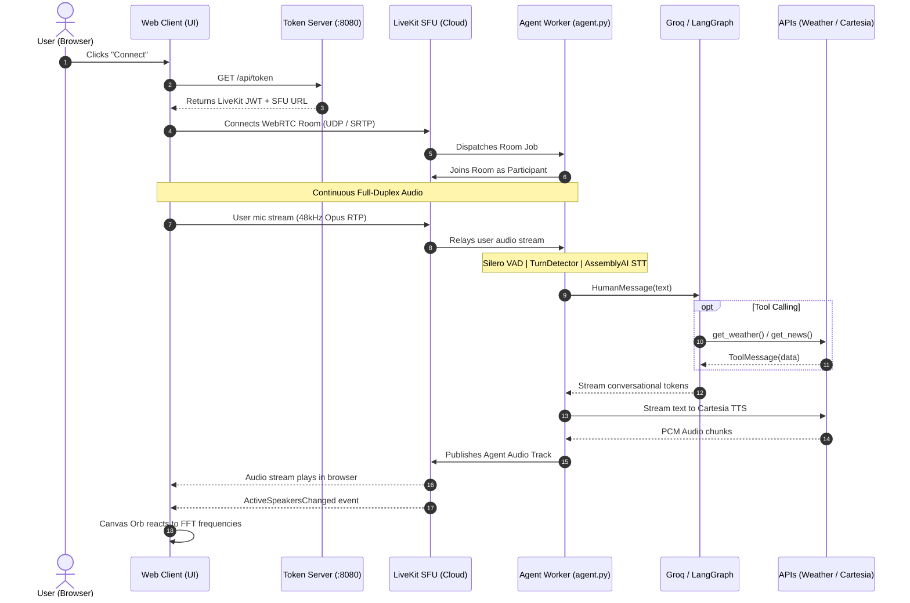

# 🎙️ LiveKit + LangGraph Tool-Calling Voice Agent

[](https://www.python.org/)
[](https://docs.livekit.io/agents/)
[](https://langchain-ai.github.io/langgraph/)
[](https://groq.com/)
[](https://langfuse.com/)

A real-time, ultra-low-latency voice assistant combining **LiveKit WebRTC transport** with an autonomous **LangGraph ReAct Agent**. The agent reasons over queries, executes real-time tool calls (`get_weather`, `get_news`), and streams conversational tokens directly into a reactive WebRTC audio pipeline.

---

## 📑 Table of Contents

- [🏛️ System Architecture](#️-system-architecture)
- [🧠 LangGraph Agent & Tool Calling](#-langgraph-agent--tool-calling)
- [🌐 Frontend ⇄ Backend Communication (WebRTC vs. FastAPI)](#-frontend--backend-communication-webrtc-vs-fastapi)
- [🌐 Web Interface & Token Server](#-web-interface--token-server)
- [🔍 Production Observability with Langfuse](#-production-observability-with-langfuse)
- [⚡ Quickstart & Execution Guide](#-quickstart--execution-guide)
- [🧪 Automated Test Suites](#-automated-test-suites)
- [📁 Repository Structure](#-repository-structure)
- [📚 References & Documentation](#-references--documentation)

---

## 🏛️ System Architecture

### End-to-End Workflow Diagram

```
                        🎤 User Spoken Audio (Opus 48kHz)
                                     │
                                     ▼
                      ┌─────────────────────────────┐
                      │    LiveKit WebRTC Cloud     │
                      │  (Low-Latency UDP/SRTP SFU) │
                      └──────────────┬──────────────┘
                                     │
                                     ▼
                      ┌─────────────────────────────┐
                      │    Voice Pipeline Worker    │
                      │ ├─ Noise Cancellation (BVC) │
                      │ ├─ Silero VAD (<50ms)       │
                      │ ├─ Semantic TurnDetector    │
                      │ └─ Streaming STT (AssemblyAI│
                      │      fallback: Deepgram)    │
                      └──────────────┬──────────────┘
                                     │ Transcribed Text
                                     ▼
                      ┌─────────────────────────────┐
                      │       LangGraph Agent       │◄────────────────┐
                      │     (Groq gpt-oss-20b)      │                 │
                      └──────────────┬──────────────┘                 │
                                     │                                │
                    [Tool Call Needed? (tools_condition)]             │
                           │                  │                       │
                          YES                 NO                      │
                           │                  │                       │
                           ▼                  │                       │
                    ┌─────────────┐           │                       │
                    │  ToolNode   │           │                       │
                    │ ├─ weather  │───────────┘                       │
                    │ └─ news     │    (ToolMessage execution)        │
                    └─────────────┘                                   │
                                              │                       │
                                              ▼                       │
                                   ┌─────────────────────┐            │
                                   │  VoiceGraphWrapper  │            │
                                   │ (Filters ToolMessage│            │
                                   │  yields vocal text) │            │
                                   └──────────┬──────────┘            │
                                              │ Spoken Tokens         │
                                              ▼                       │
                                   ┌─────────────────────┐            │
                                   │  LiveKit Agent TTS  │            │
                                   │ ├─ Primary: Cartesia│            │
                                   │ └─ Backup: Inworld  │            │
                                   └──────────┬──────────┘            │
                                              │                       │
                                              ▼                       │
                        🔊 Synthesized Speech Out (WebRTC)            │
                                              │                       │
         ═════════════════════════════════════╪═══════════════════════╪════════
                                              │ OpenTelemetry Spans
                                              ▼
                                   ┌─────────────────────┐
                                   │  Langfuse Tracing   │
                                   │ ├─ Room Session ID  │
                                   │ ├─ STT / TTS TTFA   │
                                   │ ├─ Tokens & Costs   │
                                   │ └─ Tool Latencies   │
                                   └─────────────────────┘
```

### Component Stack

| Layer | Primary Provider | Fallback / Alternative | Latency Target |
| :--- | :--- | :--- | :--- |
| **Transport** | LiveKit WebRTC (UDP/SRTP) | STUN / TURN Relay | `< 50ms` |
| **VAD & Framing** | Silero VAD + BVC Noise Cancel | Semantic TurnDetector | `< 50ms` |
| **Speech-to-Text (STT)** | `assemblyai/universal-streaming:en` | `deepgram/nova-3` | `< 300ms` |
| **Agent Core (LLM)** | Groq `openai/gpt-oss-20b` (`reasoning_effort="low"`) | Windowed State (6 turns) | `< 200ms` TTFT |
| **Text-to-Speech (TTS)** | `cartesia/sonic-3` | `inworld/inworld-tts-1` | `< 150ms` TTFA |
| **Observability** | Langfuse Cloud via OpenTelemetry | Local Metric Collector | Async / Zero Overhead |

---

## 🧠 LangGraph Agent & Tool Calling

### ReAct State Machine Flow

```
                      ┌───────────────┐
                      │  User Utterance│
                      └───────┬───────┘
                              ▼
                      ┌───────────────┐
                 ┌───►│  agent_node   │
                 │    │(Groq gpt-oss) │
                 │    └───────┬───────┘
                 │            │
         ToolMessage          ▼
                 │     [tools_condition]
                 │       │          │
                 │     [YES]       [NO]
                 │       │          │
                 └──┌────┴────┐     ▼
                    │ToolNode │   [END] ──► VoiceGraphWrapper ──► TTS
                    └─────────┘
```

### Registered Tools

| Tool | Underlying Engine | Parameters | Output / Behavior |
| :--- | :--- | :--- | :--- |
| **`get_weather`** | OpenWeather Current API 2.5 | `city: str` | Temperature (°C), humidity, conditions. Handled in ~200ms. |
| **`get_news`** | DuckDuckGo News Search | `query: str` | Top 3 news headlines. Auto-falls back to web search on rate limit (403). |

### Streaming Isolation: `VoiceGraphWrapper`

LangGraph emits tokens from **all nodes** in `stream_mode="messages"`. Without filtering, raw JSON payloads from `ToolNode` would be spoken aloud by TTS before the assistant answers.

[`src/graph.py`](src/graph.py) solves this with a lightweight streaming wrapper:

```python
class VoiceGraphWrapper:
    """Drops internal ToolMessages so TTS receives only assistant voice tokens."""
    def __init__(self, graph):
        self._graph = graph

    async def astream(self, *args, **kwargs):
        async for item in self._graph.astream(*args, **kwargs):
            if isinstance(item, tuple) and len(item) == 2:
                token, meta = item
                if meta.get("langgraph_node") == "tools" or type(token).__name__ == "ToolMessage":
                    continue  # Suppress internal tool outputs from audio
            yield item
```

---

## 🌐 Frontend ⇄ Backend Communication (WebRTC vs. FastAPI)

### Architectural Contrast

```
┌──────────────────────────────────────────────────────────────────────────────────┐
│                     1. CONVENTIONAL FASTAPI (MONOLITHIC TCP)                     │
│                                                                                  │
│   Browser FE ══════════ POST /ws/audio (TCP) ══════════► FastAPI Server          │
│   (MediaRecorder: 3s)                                   • Python Asyncio GIL     │
│   🔴 High Latency (3-6s) • 🔴 HoL Blocking • 🔴 Broken Interruption • 🔴 No AEC   │
└──────────────────────────────────────────────────────────────────────────────────┘

┌──────────────────────────────────────────────────────────────────────────────────┐
│                     2. OUR ARCHITECTURE (LIVEKIT DECOUPLED SFU)                  │
│                                                                                  │
│   [Browser FE] ── 1. HTTP Auth Handshake ──► [web/server.py] (Token Server)      │
│        │                                                                         │
│        │ 2. WebRTC PeerConnection (UDP / SRTP / Opus 48kHz)                      │
│        ▼                                                                         │
│   [LiveKit SFU Cloud] ◄─── Media & Signal ───► [Agent Worker (agent.py)]         │
│   🟢 Latency <600ms • 🟢 Zero HoL Blocking • 🟢 Instant Barge-In • 🟢 Native AEC │
└──────────────────────────────────────────────────────────────────────────────────┘
```

### End-to-End Sequence Diagram



### Why LiveKit WebRTC instead of Conventional FastAPI?

| Dimension | Conventional FastAPI (HTTP / WS) | LiveKit WebRTC (This Repo) | Technical Impact |
| :--- | :--- | :--- | :--- |
| **Transport Protocol** | **TCP** | **UDP / SRTP** | **Head-of-Line Blocking**: TCP retransmits lost packets, stalling audio for 500–1200ms. WebRTC discards stale frames and conceals loss with Opus PLC. |
| **Turn-Taking Latency**| **3,000ms – 6,000ms** (Half-duplex blobs) | **300ms – 650ms** (Continuous full-duplex) | Human conversational pacing requires sub-700ms response times. |
| **Barge-In / Interruption**| **Fragile** (Manual WS cancel signals) | **Instantaneous (<100ms)** | Silero VAD on the agent worker detects user speech and immediately flushes the SFU audio buffer. |
| **Echo Cancellation (AEC)**| **Prone to feedback loops** | **Native WebRTC AEC & AGC** | Hardware-level echo cancellation prevents the bot from hearing and transcribing its own voice. |
| **Server CPU Load** | Python GIL processes audio frames | **Zero media routing in Python** | High-throughput audio routing is offloaded to Go/C++ SFU; Python only handles AI logic. |
| **Multi-Party Support** | Requires custom pub/sub & mixing | **Native Room Architecture** | Easily allows adding human listeners, screen sharing, or multi-agent collaborations. |

---

### Real-Time Barge-In (Interruption Handling)

```
[Agent Speaking] ──► User starts talking ──► Silero VAD triggers (<50ms)
                           │
                           ├── 1. Cancels in-flight Cartesia TTS synthesis
                           ├── 2. Flushes WebRTC outbound track buffer
                           └── 3. UI fires ActiveSpeakersChanged ──► Orb turns Cyan
```

---

## 🌐 Web Interface & Token Server

Located in [`web/`](web/):
- **Dynamic Reactive Orb**: HTML5 Canvas running harmonic sine-wave oscillations mapped to 60fps Fast Fourier Transform (FFT) byte frequency data.
- **Color-Coded State Machine**:
  - `Idle`: Soft ambient glow.
  - `Listening`: Cyan / Emerald active ripple.
  - `Speaking`: Magenta / Violet harmonic waves.
- **Glassmorphic HUD**: Connect/Disconnect button, live mute toggle, session status pill, and interactive suggestion pills (*"Tokyo Weather"*, *"Tech Headlines"*).
- **Zero-Build Architecture**: Runs entirely from static HTML/JS without npm or build steps.

---

## 🔍 Production Observability with Langfuse

Every session, recognition turn, tool execution, and synthesis span is automatically captured and streamed to **[Langfuse](https://langfuse.com)** via OpenTelemetry:

```
[LiveKit Room Session: room-xyz]
 ├── 🎙️ STT Span (AssemblyAI) ────────── Latency & Transcribed Text
 ├── 🧠 LangGraph Node (Groq) ────────── Prompt, Reasoning Tokens, TTFT
 │    └── 🛠️ Tool Span (get_weather) ── Arguments, Latency, Output
 └── 🔊 TTS Span (Cartesia) ──────────── TTFA (Time to First Audio), Audio Duration
```

### Key Tracked Metrics

- **TTFA (Time to First Audio)**: Utterance-to-sound delay (~450ms–700ms).
- **TTFT (Time to First Token)**: LLM generation kickoff (~180ms).
- **Token Usage**: Cumulative prompt and completion tokens.
- **Shutdown Resilience**: Uses `trace_provider.force_flush()` to guarantee zero telemetry loss on disconnect.

---

## ⚡ Quickstart & Execution Guide

### 1. Prerequisites & Environment

```bash
# Clone the repository
git clone https://github.com/ambideXtrous9/VoiceAgent-LiveKit-Langgraph.git
cd VoiceAgent-LiveKit-Langgraph

# Configure environment variables
cp .env.example .env
```

Set the required credentials in `.env`:
- `LIVEKIT_URL`, `LIVEKIT_API_KEY`, `LIVEKIT_API_SECRET` ([cloud.livekit.io](https://cloud.livekit.io))
- `GROQ_API_KEY` ([console.groq.com](https://console.groq.com))
- `LANGFUSE_PUBLIC_KEY`, `LANGFUSE_SECRET_KEY`, `LANGFUSE_BASE_URL` ([cloud.langfuse.com](https://cloud.langfuse.com))
- `OPENWEATHER_API_KEY` ([openweathermap.org](https://openweathermap.org/api))

### 2. Dependency Installation

Managed via [`uv`](https://docs.astral.sh/uv/) on Python 3.13+:

```bash
# Install dependencies into virtual environment
uv sync

# Download Silero VAD and TurnDetector model weights
uv run python src/agent.py download-files
```

### 3. Execution Commands

| Mode | Command | Description |
| :--- | :--- | :--- |
| **Docker Compose (All-in-One)** | `docker compose up --build` | Full containerized stack (Web UI on port 7860 + Agent worker) with healthchecks. |
| **Web UI (Local)** | `uv run python src/agent.py dev`<br>`uv run python web/server.py` | Full local experience. Open `http://localhost:7860` in browser. |
| **Dev Worker** | `uv run python src/agent.py dev` | Runs agent worker waiting for room connections. |
| **Console Mode** | `uv run python src/agent.py console` | Interactive voice test using your local mic/speakers (no browser). |
| **Playground** | Open [agents-playground.livekit.io](https://agents-playground.livekit.io) | Connect to your LiveKit Cloud project directly. |
| **Production Worker** | `uv run python src/agent.py start` | High-concurrency production worker daemon. |

### 4. 🐳 Docker & Docker Compose Guide

The repository includes a production-grade, multi-stage `Dockerfile` with pre-cached model weights and non-root security.

```bash
# Start both Web UI (:7860) and Agent Worker:
docker compose up --build

# Run in detached background mode:
docker compose up -d

# Follow real-time streaming logs:
docker compose logs -f

# Check container health and status:
docker compose ps

# Graceful shutdown:
docker compose down
```

---

## 🧪 Automated Test Suites

Run diagnostics without needing an active browser session:

```bash
# 1. Edge-Case & Resilience Suite (Weather/News boundaries, Unicode, Wrapper suppression)
uv run python tests/test_edgecases.py

# 2. Direct Tool Calling & LangGraph Agent Workflow Suite
uv run python tests/test_agent.py

# 3. Langfuse Tracing & OpenTelemetry Connectivity Suite
uv run python tests/test_telemetry.py
```

---

## 📁 Repository Structure

```
VoiceAgent-LiveKit-Langgraph/
├── Dockerfile                  # Multi-stage production container image (uv + pre-cached models)
├── docker-compose.yml          # Container orchestration (web + agent worker)
├── .dockerignore               # Docker build exclusions
├── README.md                   # Consolidated project documentation
├── pyproject.toml              # Dependencies (LiveKit, LangGraph, Groq, Langfuse)
├── uv.lock                     # Locked dependency tree
├── .env.example                # Environment variables template
├── .gitignore                  # Git ignore rules
├── .python-version             # Python version pin (3.13)
├── docs/                       # Documentation assets
│   └── architecture.png        # System architecture visual reference
├── examples/                   # Reference implementations
│   └── basic_agent.py          # Minimal LiveKit pipeline agent
├── src/                        # Core application package
│   ├── __init__.py             # Package exports
│   ├── agent.py                # Main LiveKit VoicePipelineAgent worker
│   ├── graph.py                # LangGraph ReAct state machine & VoiceGraphWrapper
│   ├── telemetry.py            # Langfuse & OpenTelemetry trace instrumentation
│   └── tools.py                # Weather (OpenWeather) & News (DuckDuckGo) tools
├── tests/                      # Automated test suites
│   ├── __init__.py             # Test package marker
│   ├── test_agent.py           # Tool-calling & LangGraph workflow test
│   ├── test_edgecases.py       # Full edge-case & resilience test suite
│   └── test_telemetry.py       # Langfuse tracing & OpenTelemetry test
└── web/                        # Web frontend & token server
    ├── index.html              # Reactive audio visualizer interface
    └── server.py               # Lightweight token-issuing HTTP server (:7860)
```

---

## 📚 References & Documentation

- [Worksh.app LiveKit Voice Agent Tutorial: Introduction](https://worksh.app/tutorials/livekit-voice-agent/introduction)
- [Worksh.app LiveKit Voice Agent: Semantic Turn Detection](https://worksh.app/tutorials/livekit-voice-agent/semantic-turn-detection)
- [LiveKit Agents Python SDK](https://docs.livekit.io/agents/)
- [LangGraph ReAct Pattern Documentation](https://langchain-ai.github.io/langgraph/)
- [Langfuse LiveKit Integration](https://langfuse.com/integrations/frameworks/livekit)
- [Groq Cloud Inference](https://console.groq.com/docs)
